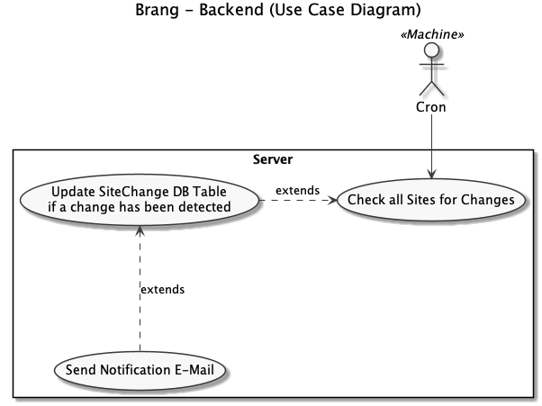
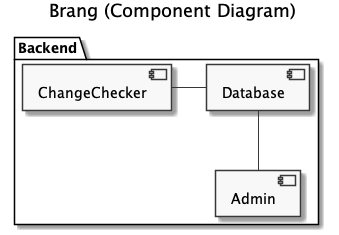

# Architecture 

## Functional Requirements
The user can use the admin.py CMD line tool to add, list and remove sites. 

The sites are observed by Brang in a regular fashion and an e-mail is 
being sent if a content change was detected. 

## Non-Functional Requirements
Target System:
* Raspberry Pi (Raspbian 9 (Stretch), Linux Kernel 4.14)
* Python 3.6.6
* SQLite Database

## System components

The ChangeChecker component is invoked by the Linux cron-system. It processes all Sites stored in the Database.

The class diagram suggests the following fields and methods for the components:
