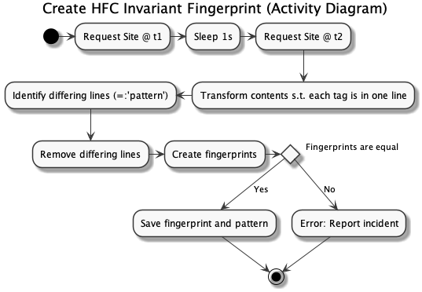
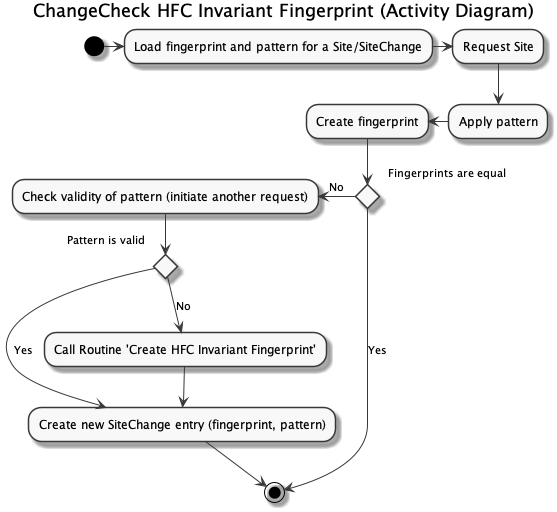

# Fingerprinting

## Invariance under high-frequent site changes
### Problem 
The content of some sites changes at a very high rate (or differ even for each single request). 
A fingerprint for those kind of sites is not suitable for tracking changes.

### Solution 
Extract those portions of the site content which changes at a high rate.

We introduce the "High-Frequency Change (HFC) invariant fingerprint" with the following activity diagram.
The key component here is the so-called 'pattern'. This is the portion (technically, a list of line-numbers) common to all HFCs of a
particular site.

For an existing SiteChange entry that contains both, a fingerprint and a pattern, the procedure for detecting changes
is outlined in the following activity diagram.

